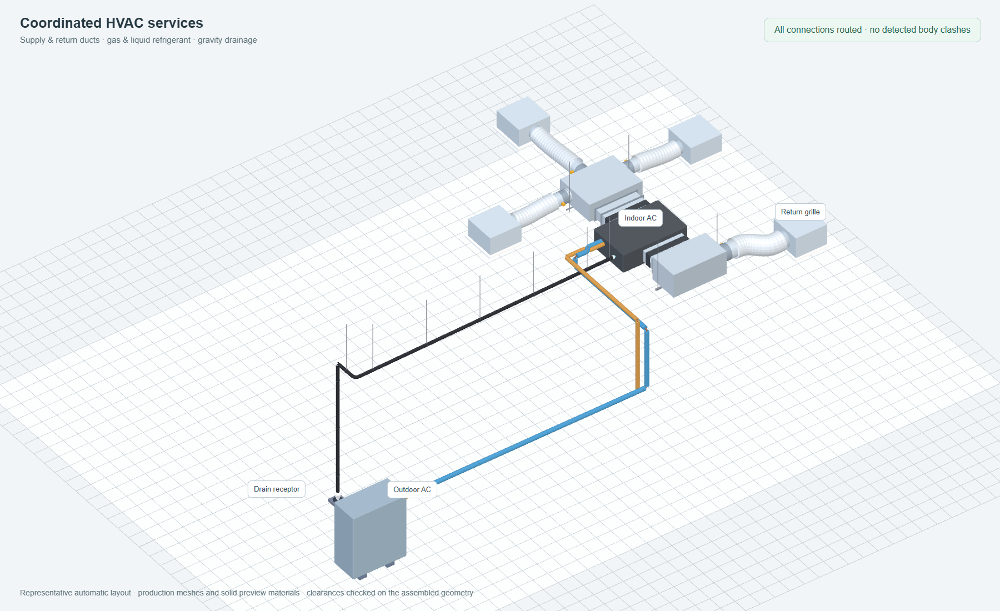

# Coordinated HVAC routing review

The routing and Apply paths now share physical body checks for ducts, insulated
refrigerant and condensate pipes, indoor/outdoor equipment casings, and terminal
faces, plenums and necks. Preview meshes use opaque, depth-tested materials.
This addresses two separate defects: geometry that could intersect without being
reported, and transparent previews that appeared to pass through other objects.

## Routing and acceptance

- Ducts remain the first service planned because of their size and fixed collars.
- The initial pipe candidate places refrigerant, then drainage. If it leaves
  clashes, missing connections or proposed hops, one additional candidate reserves
  drainage first and routes refrigerant around it. Selecting the cost objective
  also requests this comparison. The duct proposal is held fixed.
- Candidates are ordered by known physical validity, complete service coverage,
  pending hop approvals, then the selected normalized cost/fitting preference.
  A cheaper intersecting layout cannot win against a physically valid candidate.
- Surviving generated drains remain obstacles during a scoped reroute. Each new
  sink network becomes an obstacle for the following networks.
- Gravity constraints, insulated radii and available elevation bands participate
  in routing. Impossible crossings cannot count as connected units. A partial
  replacement cannot delete an existing drain network serving unconnected units.
- Apply assembles ducts, terminal adjustments, refrigerant, drains and approved
  hops before checking their combined geometry. New collisions or drainage errors
  refuse the entire command. Successful Apply remains one undo step.
- A proposed hop is not a resolved clash merely because it names the same pipe.
  Its built geometry must clear the actual drain/pipe pair. A drain contacting two
  refrigerant runs reports both. Approved hops are also checked for newly
  introduced hard refrigerant rules on the affected circuit.
- An unrelated, unchanged pre-existing clash does not block a local operation.
  Changed duct contacts are checked again even if the same IDs touched previously.
- A terminal's own plenum remains an obstacle to its branch. Spigot-side selection
  checks the physical approach; nearby take-off candidates include solid-boundary
  visibility positions, and crowded tap groups can shift without losing fitting
  spacing. Elbow centreline radius and flange-neck setback are counted separately.
  The original eleven-diffuser room and fixed-spigot detour regressions are retained.

## Geometry and mathematics

Pipes are represented by finite centreline segments with insulated outer radii
(capsules). Equipment uses oriented bounding boxes; duct fabrication pieces use
oriented, segmented outer envelopes. Legitimate equipment sockets and declared
drain junctions have bounded allowances. A branch returning through its parent,
terminal or source unit remains an obstruction.

Segment-to-box distance now uses analytical piecewise quadratic minimization,
replacing the previous iterative golden-section approximation. In local box
coordinates, a segment is `p(t) = a + t(b-a)`, `0 <= t <= 1`, with box half sizes
`h_i`. Squared distance is

`f(t) = sum_i max(|p_i(t)| - h_i, 0)^2`.

The six slab crossings partition the parameter interval into regions with fixed
active coordinates. On each region, `f` is quadratic; the algorithm checks its
stationary point (`f'(t) = 0`) and the interval endpoints. Its work is bounded by
the box geometry, rather than the segment's length. Degenerate, grazing, rotated
and very long segment cases are covered by regressions.

Pump riser clearance similarly uses continuous finite-segment distance. A bounded
bisection locates the first obstruction as the riser grows, replacing 20 mm
sampling that could miss grazing contacts. Existing graph search, gravity-profile
constraints, duct pressure calculations and life-cycle sizing remain in place.
These changes run in the current TypeScript worker; no Python service is required.

Prior pipe geometry is now loaded lazily, only when an actual contact needs a
retained-contact comparison. Its full mutation-sensitive signature remains in
use, so in-place edits cannot return stale clearance results. On the existing
four-direction indoor-unit regression, this reduced the measured run from roughly
66–67 seconds to 51.18 seconds without changing the 60-second test limit or the
selected complete route. This is one local measurement, not a universal speedup.

The collective preference index is dimensionless. Refrigerant prices are used
only when comparable project currency/rates exist; otherwise the existing material
index is used. Drain length, fitting count and pumps use explicit normalized
preferences. They are not added to duct life-cycle currency as a fabricated total.
Single-line selection does not use paired fitting or monetary totals. Proposed
hop geometry is included when refreshing refrigerant evaluation metrics.

## Verification

The representative image uses the production unified planner and mesh builder for
one FDUM indoor unit, an outdoor unit, three supply diffusers, one return grille,
six duct runs, refrigerant gas/liquid and gravity drainage. Both service orders
were evaluated; drainage-first was selected. The isolated browser check found
zero reported body clashes, zero blocking issues and zero browser exceptions.
All 191 inspected mesh materials were opaque with depth testing and writing.
Equipment used production procedural fallback geometry; catalog GLBs were not
loaded. The camera, labels and floor belong to the verification harness.

Regression coverage includes rotated solids, elevation-separated crossings,
equipment exits and re-entry, changed old contacts, terminal/parent duct loops,
45-degree and rolled crown wyes, retained scoped drains, multiple sink networks,
grazing risers, grouped hops, failed replacements, normalized candidate ranking,
exact final Apply and undo/redo. Preview, hop construction and Apply all scope
geometry to the document settings and restore the prior context afterward.

Final verification runs:

| Check | Result |
| --- | --- |
| Coordinated routing, drainage, profile validation, clearance and previews | 191 passed in 26 files |
| Full duct suite | 386 passed; 39 opt-in benchmarks skipped |
| Branch fitting proposals | 41 passed |
| Previously timed-out mixed-direction routing case | Passed unchanged at 51.18 seconds |
| Drawing-engine and web TypeScript checks | Passed |
| ESLint on all changed TypeScript/TSX files | Passed |
| Repository-wide drawing-engine lint | Existing errors remain outside the changed files |

An earlier broad HVAC run passed 1,457 tests and exposed the four failures that
prompted the focused corrections above. The refreshed representative browser run
took 3.900 seconds to plan on this machine and again reported no body clashes or
browser exceptions. These timings describe the measured fixtures only.

## Engineering scope

ASHRAE identifies space, noise, balancing, installation and operating cost among
duct design considerations. The existing duct life-cycle objective is retained;
the new coordination preference deals with shared routing space and pipework.
See the [2025 ASHRAE duct design chapter](https://handbook.ashrae.org/Handbooks/F25/IP/F25_Ch21/F25_Ch21_ip.aspx)
and [ASHRAE's duct design overview](https://www.ashrae.org/news/ashraejournal/minimizing-energy-consumption-eliminating-excessive-noise-with-duct-design-best-practices).

This is a bounded route search and body-interference check, not a proof of global
optimality or a complete fabrication/compliance model. Round/curved ducts use
segmented box approximations rather than exact mesh intersections. Bodies within an attainable drainage elevation
band can remain conservative plan obstacles; every possible underpass is not
searched. Branch-kit hulls, drainage termination shells, supports, maintenance
access, structural anchors and project-specific fire clearances are not all
represented by this shared body model. Existing specialized rules remain active.
Manufacturer qualification stays preliminary where verified model data is absent;
unknown equivalent lengths and installation requirements are not treated as passes.
