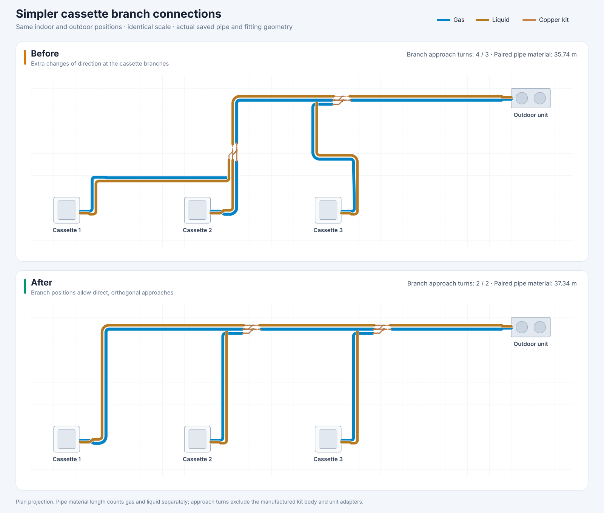

# Automatic refrigerant network design

Research and implementation notes, 7 September 2026. These describe a preliminary, two-pipe heat-pump layout tool. They do not replace the selected equipment's engineering software, installation instructions, commissioning checks, or approval of penetrations and supports.

## Using Auto route

Choose **Auto route** in the Refrigerant toolbar. Its options select balanced routing, lowest estimated installation cost, or fewest fittings; optional project rates enable a monetary estimate. Route all units in the drawing or a selected outdoor/indoor group. Multiple outdoor systems respect equipment assignments, and three-pipe/heat-recovery arrangements requiring branch selectors are left for a supported manufacturer design.

The UI enables optimizing a complete, unlocked existing network; turn that option off to preserve it. API callers opt in explicitly. A complete existing layout that passes the same construction checks is retained if the search finds no improvement for the selected objective. Locked or partial networks are preserved. Source profile, optimization objective and supplied rates are recorded with each generated network. One undo restores the previous network, and **Cancel routing** stops the calculation worker before a result is committed. If the drawing or rules change during calculation, the stale result is discarded.

Browser review was blocked in this environment. Automated graph, geometry, worker-command and store integration checks cover the implementation; final test counts are recorded with the delivery report.

## Manufacturer evidence

Daikin's RXYCQ8–20A installation manual distinguishes the outdoor main, intermediate piping and indoor terminal connections. Main and first-branch selections depend on the outdoor model; later branches and intermediate tube sizes depend on downstream indoor capacity indices. Indoor terminal tube sizes follow equipment connections. Longer routes can require specific size increases, with exceptions. Actual path length, equivalent path length, total network length, height differences and distance after the first branch are separate constraints. Its example allows horizontal or vertical REFNET arrangements subject to the fitting instructions. These are model-specific requirements, not universal values to copy into another manufacturer's profile. [Daikin RXYCQ8–20A manual, sections 6.4 and 6.6](https://www.daikin.eu/content/dam/document-library/installation-manuals/ac/vrv/rxycq-a/RXYCQ8-20A7Y1B_IM_4PEN327528-1_EN_Installation%20manuals_English.pdf).

LG's Multi V Water 5 engineering manual distinguishes main-pipe tables by equivalent route length and intermediate-pipe tables by downstream demand; it directs designers to LG's LATS design software. This supports keeping a preliminary geometric proposal separate from manufacturer-verified equipment and sizing decisions. [LG Multi V Water 5 engineering manual, piping limitations](https://files.lghvac.com/resources/EM_MultiV_Water5.pdf).

LG's Multi V IV manual describes inverted traps for particular outdoor multi-unit piping arrangements. Consequently, a geometric rise/fall or low pocket alone cannot determine whether oil will accumulate or whether an intentional trap should be removed. [LG Multi V IV engineering manual, layout best practices](https://legacy.lghvac.com/resource-service?filename=EM_MultiVIV_OutdoorUnits.pdf).

## Implemented evaluation

`autoRouteEvaluation.ts` evaluates the native VRF connection graph produced from the actual candidate elements. Gas and liquid are independent service graphs rooted at the selected outdoor unit. A visible crossing does not connect pipes. The evaluator requires one outdoor root, one connection to each intended indoor terminal, a tree without open ends or bare tees, outdoor-facing branch inlets, and matching downstream groups for the paired gas/liquid branch kits. Independent circuits elsewhere in the document are excluded.

Material quantity counts both gas and liquid tubes. A one-way total is the larger of the two coordinated service totals; it does not add the gas and liquid networks together. Equivalent length is evaluated separately for every outdoor-to-indoor path, including only fittings on that path. Unknown equivalent allowances produce an incomplete result instead of an assumed zero. Physical tubing length comes from the stored 3D centerline polyline; it is a model quantity, subject to the route's numerical representation and field installation allowances.

The evaluator uses explicit manufacturer capacity indices. A missing index remains unknown; kW, BTU/h and model capacity indices are not interchangeable. It recommends terminal sizes from equipment ports and intermediate sizes through `selectPipeSize`. It derives each branch's downstream equipment group from connectivity before calling `selectBranchKit`. Recommendations do not mutate diameters or catalogue models: changes require regeneration of sockets, bends, branch geometry, paired spacing and clearance checks.

The present profile schema does not distinguish every outdoor-main sizing table or encode every conditional length extension, capacity ratio, refrigerant charge, indoor elevation limit, safety device or operating-mode requirement. The evaluator explicitly identifies missing main-sizing information. A verified profile is checked only for the rules represented in that profile. Fallback/project values remain advisories; verified manufacturer limit violations reject the candidate.

## Technical and economic comparison

The planner searches a bounded set of constructible network alternatives. Discrete topology, allowed bend directions and catalogue fitting choices are the relevant mathematical variables; differentiation of a single unconstrained curve cannot solve this problem. The selected candidate is the best evaluated alternative, not a proof of the globally optimal network.

The search varies the first connected indoor unit and branch insertion order, then compares feasible positions along usable trunk straights. A heading-aware A* search on a rectilinear visibility grid supplies obstacle detours when direct approaches fail. Alternative paths are checked using reconstructed paired pipes and physical branch sockets, so a plan crossing alone cannot create a connection. Calculation runs in a worker to keep the drawing responsive.

Branch positions include analytically derived approach boundaries, not only the nearest point and fractional positions along the host. For opposing inline sockets, the separation must accommodate both protected socket straights and both elbow setbacks. The calculation includes the manufactured outlet's offset from the kit anchor and the paired-pipe guide radius. A position just behind an indoor port can force four elbows; moving the kit along a clear main can admit two without moving equipment, reversing the inlet, or reducing a required radius.

The bounded search gives each of up to six nearby straights its first probe, then interleaves the socket-derived positions within 24 station attempts. It no longer stops after two feasible placements. Each candidate keeps its selected physical gas/liquid hosts and is rebuilt and checked before the existing objective compares full-network quantities. Required obstacle detours remain available. Pure cost optimization still follows supplied nonnegative rates; a shorter route with more bends can legitimately win when the project prices those bends cheaply.

### Coordinating neighboring branch positions

The planner also reconsiders neighboring kits when a new indoor connection needs more than two plan bends or cannot fit. It identifies adjacent kits through the host pipes' inlet/outlet connections, including short host spans that are currently too small for another fitting. The kit may have been inserted earlier than unrelated units elsewhere in the drawing.

Candidate positions move the preceding gas/liquid pair upstream along its original straight and reserve a direct approach for the next pair. Upstream comes from the actual fitting inlet orientation in the outdoor-rooted network, not the outdoor unit's distance on the screen. The calculation includes both fitting footprints, protected straight lengths, configured kit spacing, equipment socket directions, and bend setbacks. Both translated approaches must admit at most two bends before the planner attempts reconstruction.

The search interleaves up to four candidate pairs across two neighboring insertion checkpoints. It rebuilds the affected connections from the checkpoint and replays subsequent connections, trying their saved positions first. These checkpoints exist only during calculation. Every trial passes the same gas/liquid topology, equipment, collision, level and manufacturer-profile checks as ordinary routing. All previously connected units must remain connected; the selected technical/economic objective decides whether the rebuilt network is an improvement. Existing valid alternatives remain available when a coordinated pair cannot be built. The additional search runs only for folded or failed connections and does not reduce the ordinary station search.

The physical regression uses production equipment sockets and copper-kit geometry: an earlier kit at 5300 mm leaves a later connection with four bends. Moving the earlier station upstream and reserving room for the next fitting produces two-bend approaches in both services, with no new pipe clashes. This is a bounded improvement search, not a proof of a globally optimal network or a hydraulic pressure-loss calculation.

Equipment positions and real port elevations remain fixed. Field runs use horizontal routing and plumb level transitions; arbitrary angled unit ports are currently unsupported by Auto route and are reported instead of silently moved. Saved bend factors govern both generated planar fillets and 3D sweep bends. Required radii and straight zones are measured after construction: a short leg that clamps a bend below a verified minimum cannot pass merely because the requested radius was correct.

The evaluator exposes three objectives:

- **Balanced:** a dimensionless economic comparison plus penalties for bends, risers, elevation reversals and plan wall crossings.
- **Cost:** lowest estimated cost when complete user rates are available; otherwise lowest explicitly labelled relative material/fitting index.
- **Fewest fittings:** bend, branch and riser count, followed by a bounded route-length tie-break.

User rates specify gas/liquid tube cost per metre, cost per 90-degree-equivalent bend, per gas/liquid branch pair and per service riser. They should include the labor/insulation allowances the project intends to compare. The estimate does not invent regional prices, equipment purchase costs, operating costs or pressure drop. Monetary scores are normalized by a reference from the same rates, so changing from euros to cents cannot change the preferred geometry. With no rates, the relative index is `pipe metres + 0.75 × bend equivalents + 3 × branch pairs + 1.5 × service risers`. These are software comparison weights, not hydraulic coefficients.

Bend count accumulates route turning angle divided by 90 degrees; a curved elbow represented by many segments does not become dozens of fittings. Elevation checks follow complete connected paths, including both sides of branches. New automatic layouts containing a gas low pocket are rejected before economic ranking. This is a restriction on what the software may invent, not a claim that every low pocket retains oil. Preserved existing networks use an explicit `existing-layout` policy: their geometry remains unchanged, with a manufacturer oil-return review advisory. Manufacturer-required traps need an explicit engineering design and are not synthesized from an unexplained cost advantage. Plan wall crossings are reported once for the gas/liquid pair and require coordinated openings; the evaluator does not infer structural permission, firestopping or sleeve availability.

Exact pressure-loss and energy-cost predictions require refrigerant state, operating mode and load, tube internal diameters and roughness, fitting loss data, manufacturer control behavior and suitable validated correlations. Those inputs are not available in the current document, so the implementation makes no numerical hydraulic or lifecycle-cost claim.

## Verification

Validation on 7 September 2026 covers **94 drawing-engine test files and 722 passing tests**. The full run passed 721 tests; its only failure was an older three-unit integration test's 30-second timeout. After increasing that test's allowance to 120 seconds, its entire 12-test file passed with all geometry assertions unchanged. A separate execution of the same three-unit fixture completed in 50.7 seconds with all ports connected, four copper kits, and no graph errors or pipe clashes. The broader station search increases calculation time; it remains in the cancellable worker. Drawing-engine and web TypeScript checks, targeted ESLint, browser ESM bundle compilation and `git diff --check` also passed. Live browser inspection remains unavailable: automatic approval review rejected the Chrome launch with the reason "blocked by policy."

The production worker, bundled as browser ESM and exercised through a worker-thread message adapter, completes the ordinary three-cassette example with four physical copper kits (two gas/liquid pairs), five service risers and no elevation reversals. Cancelling after the first progress message terminates calculation without a result commit. This is an automated worker-protocol check, not a browser interaction test.

Geometry tests exercise mixed equipment orientations, all four cardinal room rotations, a wider 120 mm clear gap, exact service socket endpoints, and production 3D equipment/pipe/kit mesh builders. A synthetic verified 150 mm bend requirement is checked against the constructed geometry after document settings are restored. An impossible requirement preserves the original network. Store integration tests check one-step undo/redo, normalized ownership, and retention of an equal-cost valid layout on repeat routing.

The branch-refinement regression reproduces unnecessary cassette approaches under original, rotated and mirrored equipment layouts, and checks them against a separately constructed feasible two-bend layout. A separate obstacle case requires and retains its detour. Re-optimizing the saved three-cassette example replaces 14 network elements atomically: the two branch approaches change from four/three turns to two/two, and the dimensionless balanced score improves from 169.920 to 154.239. Equipment positions and the source objects remain unchanged. These scores are comparison weights, not monetary savings or pressure-loss results.

