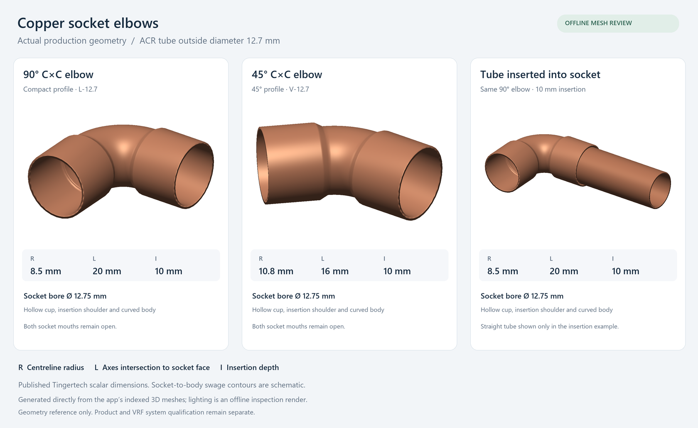

# Copper C×C elbows: dimensional geometry and implementation

7 September 2026 · ProvacX HVAC drawing and engineering workflow

## Result and scope

The application now models separate 90° and 45° copper-to-copper capillary elbows, with two female cups, insertion shoulders, open bores and a curved body. Pipes enter the cups to their resolved insertion stops. Plan and 3D presentation use the same fitting positions and dimensions. The change addresses the product geometry in the supplied reference image; it does not establish pressure ratings, equipment approval or a fabrication-ready manufacturer solid.

The illustration is an offline render of the application's indexed production meshes. It is not a live-browser screenshot. Published scalar dimensions and schematic swage contours are distinguished in the image.

## What the primary sources establish

The Copper Development Association identifies C×C 90° and 45° elbow families and describes the tube entering the fitting cup to its stop. The cup is an overlapping connection, so the socket mouth is not the tube's cut endpoint. [CDA Copper Tube Handbook, 2024/23, figures 14.4–14.5 and brazing assembly](https://www.copper.org/publications/pub_list/pdf/copper_tube_handbook.pdf).

ASME B16.22 covers wrought copper/copper-alloy pressure fittings, including fitting-end dimensions and tolerances, and identifies ASTM B280 air-conditioning/refrigeration tube within its scope. Its public description does not supply a universal elbow radius or certify a particular rendered profile. The full standard was not used as an accessible dimensional catalogue. [ASME B16.22-2021 official scope](https://www.asme.org/codes-standards/find-codes-standards/b16-22-wrought-copper-copper-alloy-solder-joint-pressure-fittings).

Tingertech publishes separate compact 90°, long-radius 90° and 45° dimensional tables and cross sections. The reviewed drawings identify `D` as socket bore, `R` as centerline radius, `L` as axes-intersection-to-mouth distance, and `L1` as insertion depth. `D` must not be used as the connected tube OD. The pages are undated and were accessed on 7 September 2026. [Compact 90° table](https://www.tingertech.com/Pipe-Fittings-Reducing-Elbow-Welding-Copper-Fittings-90-Deg-Long-Radius-Elbow-For-Air-Condition-pd49565802.html), [long-radius 90° table](https://www.tingertech.com/Hvac-Asme-Plumbing-Welding-Manufacturer-Copper-Fittings-90-Deg-Long-Radius-Elbow-For-Refrigeration-Hvac-pd41635802.html), [45° table](https://www.tingertech.com/45-Degree-Easy-Bend-Refrigeration-Pipe-Fittings-Copper-Pipe-Elbow-for-HVAC-and-Plumbing-pd43605802.html).

## Dimensional selection

The following common sizes are implemented. All values are millimetres; each tuple is **R / L / insertion**.

| Connected tube OD | 90° geometry reference | R / L / insertion | 45° geometry reference | R / L / insertion |
| ---: | --- | --- | --- | --- |
| 6.35 | L-6.35 | 5 / 12 / 6 | V-6.35 | 6.6 / 10 / 6 |
| 9.525 | L-9.52 | 7 / 16 / 8 | V-9.52 | 9.4 / 13 / 8 |
| 12.7 | L-12.7 | 8.5 / 20 / 10 | V-12.7 | 10.8 / 16 / 10 |
| 15.875 | LD-15.88 | 27 / 38 / 12 | V-15.88 | 13.6 / 19 / 12 |
| 22.225 | L-22.23 | 15 / 32 / 15 | V-22.23 | 17.8 / 25 / 15 |

The table uses the three Tingertech references above. Rounded imperial labels are explicit aliases and retain their source label and match status; they do not turn compatibility into a verified result. Additional coherent published compact sizes are included in the source module. Arbitrary nearest-size matching is prohibited: for example, a published 38 mm fitting with a 38.10 mm bore is not silently selected for 38.1 mm OD tube.

Two compact rows fail a simple geometric consistency check: L-15.88 has `L − R − insertion = −7 mm`; L-19 gives `−8 mm`. They are excluded from automatic compact selection. The LD-15.88 alternative overlaps the nominal tangent by 1 mm: its complete straight cup and published radius are retained, while the joining swage is explicitly schematic. Exact swage contours and production tolerances are not published. [Compact drawing](https://iororwxhpkjili5q.ldycdn.com/cloud/ljBplKqmlrSRijirinnkio/90-Deg-Copper-Elbow.jpg), [long-radius drawing](https://iororwxhpkjili5q.ldycdn.com/cloud/lpBplKqmlrSRijirnokoio/90-Deg-Long-Copper-Elbow.jpg).

The bounded follow-up found no complete coherent replacement dataset for the unresolved sizes. NDL publishes size-specific elbow dimensions without the full radius/insertion set; C-FLO lists radii without a complete socket/takeoff set. Combining these into a supposedly verified manufacturer part would be unjustified. [NDL ACR technical submittal](https://ndlindustries.com/wp-content/uploads/2025/01/ACR-Copper-Fittings-Technical-Submittal-Form.pdf), [C-FLO copper elbow data](https://www.c-flo.com/copper-elbow-manufacturer-supplier.html).

For uncovered sizes, the application uses a named **planning profile**, not a fabricated catalogue SKU. Its assumptions are stored in the actual rendered dimensions: wall `max(0.8, 0.04 × OD)`, insertion `max(6, 0.65 × OD)`, radius `OD`, and face distance `R tan(angle/2) + insertion + 2 × wall`. These are software planning assumptions; the handbook supports the C×C construction concept, not these numerical rules. Body bore and unpublished swage contours are also parametric.

## Geometry and application behaviour

For a circular turn through angle θ, the tangent setback is `R tan(θ/2)`. Socket takeoff and insertion are separate values. For two fittings on one straight of length S between their virtual corners, visible face-to-face pipe length is `S − La − Lb`, while the cut tube includes both insertions: `S − (La − Ia) − (Lb − Ib)`.

The route compiler identifies a complete 45° or 90° turn from validated circular samples or a sharp control corner, including vertical planes. It then rebuilds the fitting at the actual virtual corner. It does not install an elbow at every sampled point, resize a selected part to squeeze it into a short span, or classify every small unit-port transition as a stock fitting. Both adjoining takeoffs and protected unit straights are checked together. Unfit geometry retains its existing route and reports a local issue.

The copper shell contains an uninterrupted bore, full-depth cups and annular mouth faces. Inserted pipe geometry has no solid disk at the socket stop. Copper detail exposes the fittings for inspection; **Insulated** restores a separate conservative cover envelope. A tight elbow's insulation can be wider than its bend radius, so its cover is a non-self-intersecting hull rather than a spindle-shaped tube sweep. The hull is a planning clearance envelope, not an insulation product catalogue model.

Use **Refrigerant → Route defaults → Fitting view** to choose **Copper detail** or **Insulated**. Existing eligible routes are interpreted on render; changing this display choice does not move equipment or require redrawing the network.

Verified project minimum-radius checks remain active. A smaller unqualified elbow does not replace a bend governed by that minimum. Such portions retain the permitted tube-bend geometry. Product qualification, refrigerant compatibility and manufacturer approval remain separate from dimensional/profile selection.

## Evidence gaps and stopping decision

The required shape families, connection behaviour and dimensional definitions have primary support. Exact swage tooling contours, product tolerances and equipment compatibility remain unavailable or project-specific. Discovery covered CDA/ASME construction definitions and Tingertech/Conex/Mueller dimensional references; follow-up checked the inconsistent rows and NDL/C-FLO alternatives. Research stopped after the remaining gaps were bounded and given explicit planning representations, rather than repeating weaker catalogue searches.

## Verification

Validation covered fitting dimensions, hollow-shell topology, tube insertion, shared plan/3D placement, protected unit approaches, vertical turns, insulation clearances, and complete automatic networks with rotated and mirrored equipment layouts. The production meshes were also reviewed in the offline illustration above.

The full regression run exercised 829 tests: 824 passed and five exceeded their time budgets. All five subsequently passed in focused serial reruns within the unchanged limits after routing evaluation improvements. The final private clearance cache adds 21 passing tests for invalidation, cached/uncached geometry parity, and bounded storage; its 20 existing clearance tests also pass. These results combine the full run and focused reruns, rather than representing one final all-green full-suite run.

Drawing-engine and web TypeScript checks, targeted changed-file lint, UI/worker bundling, and `git diff --check` pass. Validation used automated geometry/integration tests and offline production meshes; live-browser interaction was not checked in this pass. Product pressure qualification and project-specific equipment approval remain outside these software checks.
