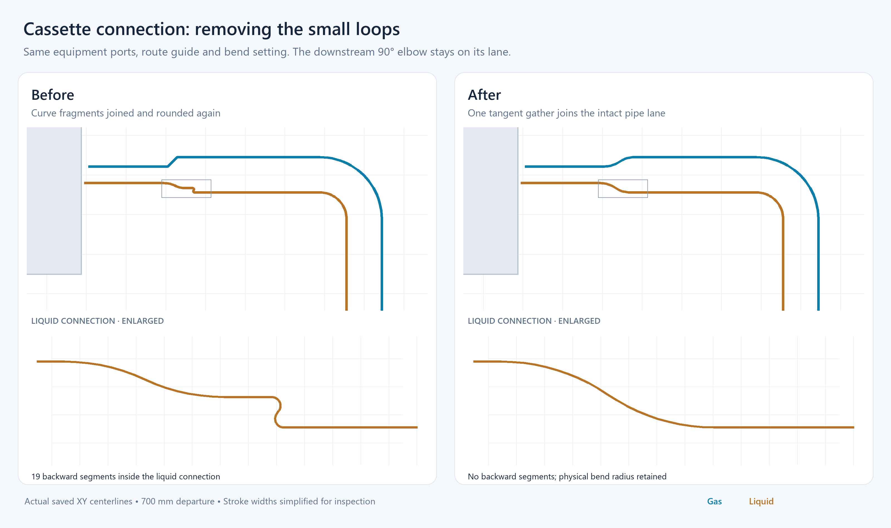

# Refrigerant field bends and copper fittings

Research checked 7 September 2026. This document records geometry evidence and implementation constraints; it does not certify fittings for a particular refrigerant system.

This records the initial formed-bend refinement. The subsequent C×C socket-elbow implementation is documented in [Copper C×C elbows: dimensional geometry and implementation](hvac-copper-socket-elbows.md).

## Three construction methods need separate geometry

A continuous tube bend has no fitting sockets or additional brazed joints. A manufactured capillary elbow has its own bend body, sockets and insertion depths. A refrigerant press elbow has a different socket/seal envelope and installation method. Selecting a radius must preserve this distinction.

Daikin's FDXM-F(9) installer reference, revision 4P550955-1D (2025.06), section 7.2.4, requires a pipe bender and gentle tube bends with a radius of 30–40 mm or greater. This is guidance for the specified equipment; it does not establish one universal radius for every tube size, material temper or manufactured elbow. [Daikin guide, p31](https://www.daikin.eu/content/dam/document-library/Installer-reference-guide/ac/split/fdxm-f3/FDXM-F3.FDXM-F9_Installer%20reference%20guide_4PEN550955-1D_English.pdf).

Actual tube benders provide discrete former radii. RIDGID's 400 series lists actual tube OD, rather than plumbing nominal size: model 404 bends 1/4-inch OD at 5/8-inch radius (15.875 mm); model 406 bends 3/8-inch OD at 15/16-inch radius (23.8125 mm); model 408 bends 1/2-inch OD at 1.5-inch radius (38.1 mm). Its stated material scope includes annealed copper with wall thickness at most 1.5 mm. These are tool capabilities, not permission to override a larger equipment minimum. [RIDGID 400 series](https://www.ridgid.com/us/en/400-series-instrument-benders).

## Explicitly dimensioned brazed-elbow examples

The following are **supplier geometry references**, not automatically approved project parts. Tingertech publishes separate brazing/sweat 90° and 45° products with dimensioned cross sections. The drawings explicitly point `R` at the dashed centerline arc, `L` from the socket face to the intersection of the straight connection axes, and `L1` from the face to the socket shoulder. `D` is the socket bore; it must not replace the connected copper tube's outside diameter. All dimensions below are millimetres.

| 90° long-radius model | Connected nominal tube OD | D | L | L1 | R |
| --- | ---: | ---: | ---: | ---: | ---: |
| LD-9.52 | 9.52 | 9.57 | 22 | 8 | 12.7 |
| LD-12.7 | 12.7 | 12.75 | 28 | 10 | 19 |
| LD-15.88 | 15.88 | 15.95 | 38 | 12 | 27 |

Source: [Tingertech 90° table](https://www.tingertech.com/Hvac-Asme-Plumbing-Welding-Manufacturer-Copper-Fittings-90-Deg-Long-Radius-Elbow-For-Refrigeration-Hvac-pd41635802.html), [dimensioned cross section](https://iororwxhpkjili5q.ldycdn.com/cloud/lpBplKqmlrSRijirnokoio/90-Deg-Long-Copper-Elbow.jpg).

| 45° model | Connected nominal tube OD | D | L | L1 | R |
| --- | ---: | ---: | ---: | ---: | ---: |
| V-9.52 | 9.52 | 9.58 | 13 | 8 | 9.4 |
| V-12.7 | 12.7 | 12.75 | 16 | 10 | 10.8 |
| V-15.88 | 15.88 | 15.95 | 19 | 12 | 13.6 |

Source: [Tingertech 45° table](https://www.tingertech.com/45-Degree-Easy-Bend-Refrigeration-Pipe-Fittings-Copper-Pipe-Elbow-for-HVAC-and-Plumbing-pd43605802.html), [dimensioned cross section](https://iororwxhpkjili5q.ldycdn.com/cloud/llBplKqmlrSRijiripjnio/45-Deg-Copper-Elbow.jpg).

The supplier's refrigerant and standards statements do not provide the pressure/temperature certification, dimensional tolerances, drawing revision and equipment approval needed for automatic system qualification. The rounded 9.52/15.88 labels also require explicit mapping to a project's exact imperial OD convention. Additionally, some 90° rows have `L − R < L1`: do not infer independent cylindrical sockets and a perfect torus with zero-length swage transitions from this abbreviated table. Request a production drawing or CAD model before claiming an exact fabrication solid.

## Sources that must not be substituted silently

Conex Bänninger publishes ACR capillary 9607LT long 90° and 9606 45° families. The reviewed range sheet establishes product families and sizes, but lacks an explicit centerline-radius table. [Conex ACR range](https://conexbanninger.com/wp-content/uploads/2024/02/B_-ACR-Product-Range-Sheet.pdf).

Mueller's HVACR catalog identifies its fitting diameters as actual OD. An individual Streamline item can instead expose a plumbing nominal heading; therefore a nominal label or bounding-box dimension alone cannot establish its connection OD or centerline radius. [Mueller HVACR catalog](https://muellerstreamline.com/?wpdmdl=232), [example long-radius elbow item](https://streamlineproductinfo.muellerstreamline.com/item/elbows/mueller-streamline-90-elbow-long-radius-c-x-c/w-02717).

Aalberts explicitly publishes `radius`, `l1` and `z1` for CoolPress COP5002L. Examples are OD12.7: R26/L44/Z26; OD15.9: R29/L51/Z30; OD19.1: R34/L56/Z34 mm. Those dimensions belong to refrigerant **press** fittings. Their convenient completeness does not make them valid geometry for a brazed elbow. [Aalberts CoolPress long 90°](https://aalberts-ips.eu/products/detail/cop5002l/).

## Implementable rules

These are software-design conclusions from the evidence, not additional manufacturer requirements:

1. Store construction method, manufacturer/model, connected copper OD, angle, centerline radius, each end's center-to-face length and socket depth separately, together with source and qualification status. Unknown dimensions stay unknown; do not derive radius from center-to-face length or plumbing nominal size.
2. Reserve real straight access and bend envelopes at equipment ports before solving the paired route. Preserve both socket positions and tangents. Use direct orthogonal turns where possible, and only add a 45° fitting or intentional offset when its geometry and purpose are explicit. The available 45° products do not justify arbitrary diagonal routing.
3. Render the same tangent line/circular-arc geometry used for route validation. A second generic corner smoothing pass changes the intended bend and can create the small pinched shape beside a socket. Preserve the radius; move the bend or reject the proposed geometry when space is insufficient.
4. For a circular bend turning through angle `theta`, tangent setback is `R * tan(theta / 2)` and arc length is `R * theta` with radians. Socket insertion and face offsets are additional catalog dimensions, not substitutes for this radius. Purchased elbows also contribute their actual joint and fitting quantities; continuous field bends do not gain fictitious sockets.
5. Check insulated clearances separately from bare-copper radius. A small valid copper elbow may have a centerline radius below the outer insulation radius; a naive full circular insulation sweep would self-intersect. Model a suitable cover/envelope separately. Do not enlarge a catalog radius silently and still identify the rendered object as that catalog part.
6. Keep field-bend defaults until the selected project profile supplies a compatible, dimensioned fitting. Unverified supplier geometry can support an explicitly preliminary catalog choice; it must not turn the network's manufacturer status into verified. No reviewed source supports one universal HVAC elbow radius or certification based on visual resemblance alone.

## Applied geometry changes

The cassette connection previously stitched the first three *samples* of a rounded takeoff onto a second rounded pipe lane, then rounded that composite again. This created a small reverse-turning loop even on a 700 mm departure. The connection builder now joins the actual sockets to the intact paired lane and constructs the transition once. Equipment positions, socket tangents and the downstream field elbow stay fixed.

Automatic branch approaches reserve the actual socket stagger and lateral spacing transition before the first field elbow. For two tangent circular arcs gathering a lateral displacement `d` at radius `R`, the required forward advance is `2R sin(acos(1 − d/(2R)))` when the displacement can be absorbed by the two arcs. Larger offsets retain a straight between the turns. This reserve is added to the protected unit stub; the orthogonal solver separately reserves the first field elbow's tangent setback. The default cassette example needs about 392 mm total departure, rather than the previous 311 mm.

`fieldPipeBends.ts` constructs single-pipe field bends from constant-radius circles with tangent straight legs. It identifies 45° and 90° patterns, preserves the saved radius policy, and checks adjacent bend takeoffs and protected socket straights together. It does not shrink an elbow to fit a short span: an insufficient manual span remains an unresolved corner through the existing invalid-geometry presentation. Per-span material/editing identities are retained by splitting the shared arc at its midpoint. Free-form Catmull–Rom curves no longer shape refrigerant field runs.

Plan previews consume these model points without another rounding pass. The same saved bend radius feeds elevation lifting and the 3D sweep. The sweep recovers an analytical circle only from a verified coplanar sample sequence with matching tangent joins. This removes the tilted cross-section at a sampled elbow's first and last ring without moving the stored path or smoothing a manual corner. Manufactured copper branch-kit geometry uses its own fixed body geometry and is independent of the field-pipe radius control.

Short unresolved manual spans receive a local dashed indicator in the active SVG drawing, without a modal warning. A zero-clearance 180° reversal is also unresolved; it is not interpreted as a valid straight continuation or fabricated U-bend.

The implementation renders **formed field bends** and the existing manufactured branch kits. The supplier elbow dimensions above remain references; no unspecified brazed or press SKU is silently selected, and a formed bend is not counted as an additional purchased elbow. Exact stock-elbow bodies and their insulation covers require a qualified, dimensioned catalogue model. This distinction prevents a visually plausible curve from being presented as a verified manufactured fitting.

The comparison uses the same cassette ports, 700 mm departure guide and saved radius factor. Its baseline reconstructs the previous stitching algorithm in an offline harness; current geometry comes from the production builder. It is a centreline illustration with simplified stroke widths, not a browser screenshot. The baseline contains 19 backwards liquid-pipe segments inside the small connection loop; the current route contains none.

## Verification

All 761 tests in 96 files are covered by the full run and targeted reruns. The serial full-suite run collected 759 tests before the final two edge cases were added. It passed 750; six mesh assertions used geometry compiled before the analytical-circle correction, and three rotated-network cases exceeded their existing 60-second test limit. The current bend/rendering subset passes all 36 tests, including the six corrected assertions and both added edge cases. All eight network-geometry tests pass on retry (261.75 seconds total). The rotated-network test allowance is now 120 seconds, with every geometry, connection and elevation assertion retained. A final run of all six 3D test files also passes all 35 tests.

Both drawing-engine and web TypeScript checks pass. ESLint passes for the changed production geometry, rendering and routing files and the new fitting tests. The UI and route-worker bundles build successfully, and `git diff --check` passes. The image above is an offline production-geometry comparison; no live-browser visual verification is claimed.
