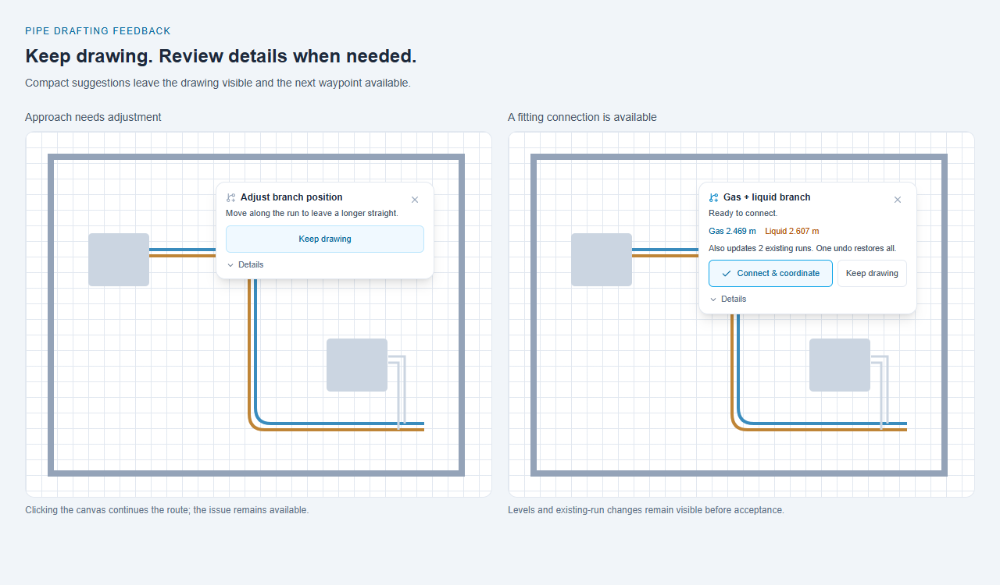
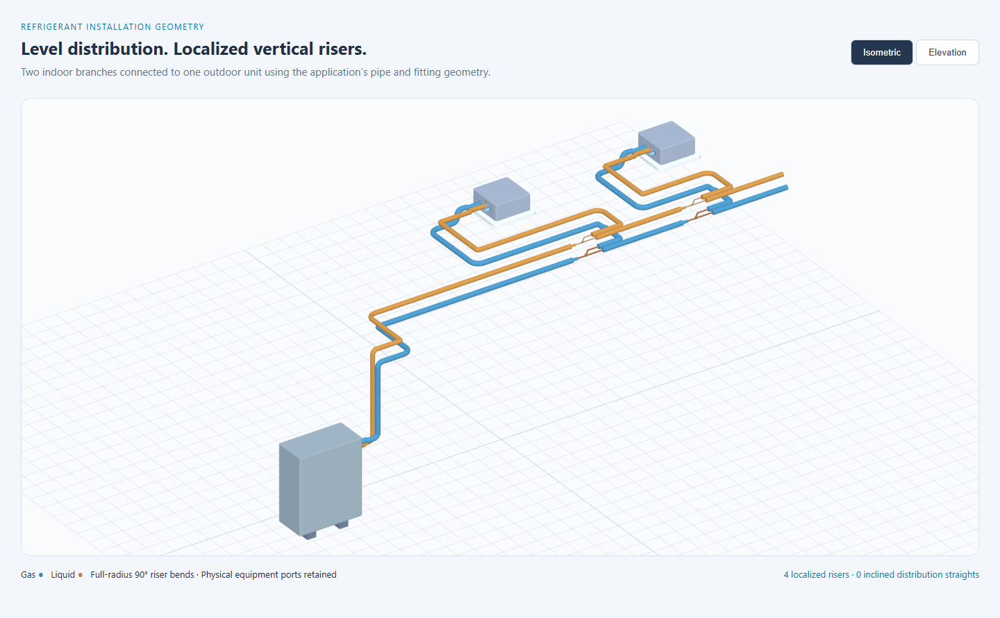
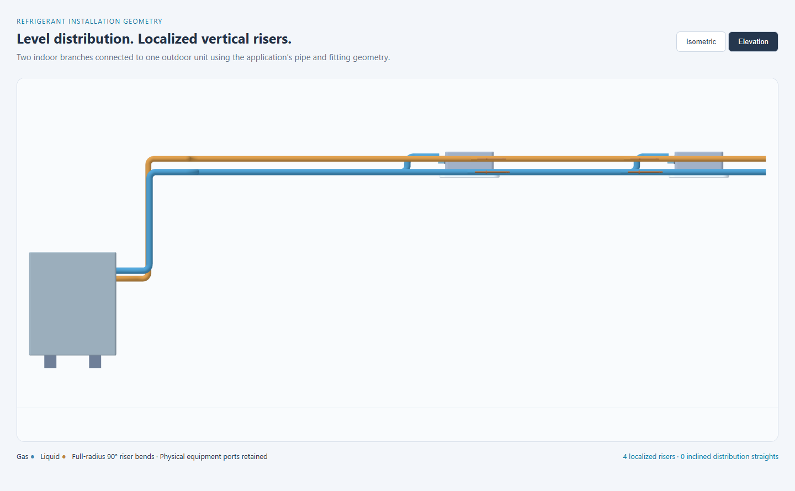
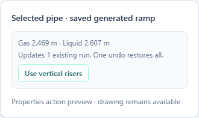

# Refrigerant network levels and paired branch planning

Reviewed 6 September 2026. This note supports network-aware drafting in ProvacX. It distinguishes manufacturer requirements from geometric routing preferences; a geometry score is not a refrigerant pressure-drop calculation or manufacturer approval.

## Manufacturer evidence

Only manufacturer-hosted documents were used. Printed page numbers are given below. Daikin EMERION printed page 20 is PDF page 23. LG Multi V S printed and PDF page numbers agree. The two PDFs were downloaded and the relevant diagrams inspected where the browser PDF reader could not fetch them.

| Primary source | Relevant documented requirements | Scope |
| --- | --- | --- |
| [LG Multi V S installation manual, pp. 39, 45, 50–51](https://legacy.lghvac.com/resource-service?filename=IM_MultiV_S_OutdoorUnits.pdf) | Minimize bends, use generous radii, and avoid traps/sags. For obstacle bypasses, prefer passing above; passing below is permitted where necessary, with horizontal span at least three times the largest rise/fall. Indoor Ys allow horizontal or vertical installation: horizontal straight leg level, branch within ±5°; vertical straight leg within ±3° of plumb. Inlet faces outdoor; outlets face indoor. First indoor Y is at least 3 ft from outdoor, with 20 in between a Y and other fittings/indoor units. Heat-pump branch kits include one vapor and one liquid fitting. | This manual's Multi V S systems. These dimensions and tolerances must not silently become every manufacturer's rules. |
| [Daikin VRV EMERION RXYQ-A installation manual, pp. 12–16, 20](https://www.daikinac.com/docs/default-source/vrv-emerion-heat-pump/im-en_3p657316-2f.pdf) | First-branch selection uses outdoor capacity; subsequent branches use total downstream indoor capacity. Actual/equivalent length, total length, after-branch length, and outdoor–indoor/indoor–indoor heights have separate conditional limits. Indoor REFNET joints allow horizontal installation within ±30° or vertical installation; headers require horizontal installation. Outdoor multi-connection joints require horizontal installation within ±15°, with straight length requirements. Outdoor interconnects exceeding 2 m require a gas-line rise of at least 200 mm within 2 m of the kit. | Specific models and combinations in the manual. Outdoor combining rules differ from indoor distribution rules. Size increases and controller settings can change allowable lengths/heights. |
| [LG Multi V IV engineering manual, pp. 127, 137, 143–144](https://legacy.lghvac.com/resource-service?filename=EM_MultiVIV_OutdoorUnits.pdf) | Separates indoor-distribution Ys from outdoor-combining Ys. Outdoor Ys permit horizontal or vertical-up installation, but not vertical-down. Separated outdoor modules can require inverted traps in vapor lines; their placement depends on horizontal distances and downward routing. Large radii reduce equivalent length; sagging tubing can retain oil. | Multi V IV. These outdoor exceptions must not be used to add traps automatically to ordinary indoor branches. |
| [Daikin VRV reference guide, p. 22](https://www.daikinac.com/docs/default-source/general/vrv/rg-pm-dvrv_09-22.pdf) | The illustrated oil-equalization arrangement is explicitly for linked outdoor modules. Its trigger concerns individual horizontal spans, not simply the summed route length. | Supports topology-specific classification; the applicable installation manual takes precedence. |

The manuals do **not** establish one universal vertical gas/liquid gap, a universal rule that gas must always be above liquid, or a universal requirement to put all indoor branches at exactly the same elevation. The horizontal-plane requirement concerns each fitting's terminals. It does not by itself require the separate gas and liquid fittings to share one centerline elevation.

The automatic installation layout now uses **level distribution runs with localized vertical risers**. This is the project's routing preference, supported by the need for controlled bends, straight fitting approaches and avoidance of unnecessary level reversals. [LG Multi V S installation tips, p. 4](https://legacy.lghvac.com/resource-service?filename=TT_MultiV_S_AirSourceSystem_Install_Tips.pdf) recommends minimizing bends and using large radii; it explicitly permits both 45° and 90° long-radius field elbows. Consequently this change does not claim that every inclined pipe is prohibited. Deliberate obstacle bypasses and manufacturer-specific arrangements remain distinct from an automatically generated elevation ramp.

## Quantities the application must keep separate

1. **Insulated clearance:** the shortest separation between the outside surfaces of the two insulated pipes. Centerline separation depends on both insulated diameters. A display-space gap must never alter physical geometry.
2. **Service elevation:** the gas and liquid centerline heights along a run. A vertical arrangement can have two stable service levels; a side-by-side arrangement can share one level.
3. **Fitting orientation:** each Y body and its inlet, run outlet and branch outlet must retain the modeled installation plane and legal orientation for its product profile.
4. **Network transitions:** rises/drops needed to join actual equipment ports, building routing zones and existing mains. A unit's rotated port position and direction are physical inputs, not suggestions to move for prettier pipework.

These distinctions are implementation conclusions from the evidence. They are not additional manufacturer rules.

## Recommended planning policy

Treat a connected refrigerant system as a graph whose edges have a service identity and whose nodes are physical equipment ports or fitting terminals. Derive upstream orientation from a verified path to the outdoor unit, independently for gas and liquid. Screen proximity and authoring direction do not establish the outdoor side. Unrelated nearby indoor units must not influence a system's preferred level.

For a new branch into an existing main, keep the main's actual service levels and place each fitting on its corresponding host centerline. Do not insert local up/down offsets merely to obtain a cosmetic pair gap. Enumerate candidate branch stations and physical orientations that preserve both host connections and their straight approach zones. Rank feasible alternatives using the connected indoor terminals, their transformed directions, the outdoor-root direction and the candidate's full branch route.

Use one stable trunk level through a same-level distribution zone where feasible. Localize necessary monotone transitions near terminal takeoffs or deliberately chosen riser zones; do not reset the level independently at every fitting. Different-floor equipment, fixed existing mains and installation zones remain constraints. Do not silently move an entire existing network to an arithmetic mean of unit heights when adding one branch.

Prefer horizontal clearance or a better branch station when these avoid extra rises/drops and remain clear of building geometry. If an authored obstacle bypass, installation zone or explicit riser constrains the path, retain it. A reversal detected in an existing route is a review finding, not permission to erase that geometry.

## Geometry metrics for transparent decisions

For a service route sampled at physical stations with elevations `z[0] ... z[n]`, compute:

```text
verticalTravel = sum(abs(z[i+1] - z[i]))
necessaryRiseOrFall = abs(z[n] - z[0])
excessVerticalTravel = max(0, verticalTravel - necessaryRiseOrFall)
```

A monotone route has zero excess travel. A down-then-up excursion contributes additional travel even when its endpoints match. Collapse consecutive level stations and numerical noise before counting elevation-direction reversals, so tessellated bend points do not become fictitious fittings. Check concatenated paths through joints as well as individual pipe elements: a low point can straddle two elements that are each monotone in isolation.

Use a lexicographic ranking of feasible candidate layouts:

1. Preserve fixed equipment/host connections and required approach lengths; reject service/topology conflicts and known clashes.
2. Minimize newly introduced low points and unnecessary level reversals.
3. Keep the two service corridors compact at the configured insulated clearance; saving one transition must not create a storey-height gap between services.
4. Minimize the number of required elevation transitions and bends, then vertical travel. When those costs tie, favor mains near the connected indoor distribution zone before minimizing displacement, allowing a common outdoor rise instead of repeated tall indoor drops. When recovering a short new approach, prefer levels reachable with less terminal rise/fall.
5. Prefer usable existing routing levels and the smallest station adjustment. Validate the complete new branch before retaining an existing level choice.

This ordering prevents a shorter but trapped-looking route winning solely on distance. A single endpoint transition may be unavoidable; it should not be penalized like a gratuitous down/up pair. For a future unbuilt floor-zone planner, a weighted median of terminal elevations minimizes the sum of absolute vertical deviations, but it is only a candidate generator: discrete fitting counts, port directions, obstacles and path-level reversal checks still decide feasibility. Do not call this hydraulic optimization.

## Honest validation and interaction

- A concise proposal should explain the relevant outcome: keeping main levels, required terminal rise/drop, added bends, or the reason no simple connection fits. Show details on demand.
- Use terms such as **level reversal** or **low point to review** for geometric findings. A U-shaped plan route is not automatically an oil trap; an elevation reversal is not enough to prove one either, because documented obstacle bypasses and outdoor exceptions exist.
- Separate indoor distribution from outdoor multi-module piping before applying trap/orientation rules. If the application cannot establish that distinction, preserve authored geometry and report that verification needs the system profile.
- A drawing with no detected low points still needs actual/equivalent lengths, downstream capacities, supported indoor/outdoor combinations, refrigerant, pipe diameters, operating conditions and the applicable manufacturer's design process. Fewer bends are a geometric improvement, not a quantified pressure-drop saving.
- Store the chosen levels and reason with the route. Preview and commit must use the same geometry; later unit moves must re-evaluate affected paths without accumulating fresh offsets at every edit.

## Verification cases for implementation

Cover same-level indoor terminals; mixed-height and rotated indoor ports; outdoor above and below the indoor distribution; reverse-authored gas/liquid hosts; stable paired levels through multiple Ys; a main insertion that would otherwise generate a dip; a low point crossing two pipe elements; short approaches without sufficient straight length; explicit obstacle bypass preservation; disconnected/ambiguous outdoor topology; and multiple outdoor modules with model-specific exceptions. A second run with unchanged inputs should produce the same levels and station choice.

## Implemented workflow

The branch proposal now performs a connected-network level analysis. Connections, gas/liquid bundle identities and fitting terminal references define its scope; nearby unconnected equipment does not get silently assigned to a system. Each service's equipment port elevations and outward directions remain physical constraints.

Usable main levels take priority when the new takeoff also fits. Where the existing main cannot supply the configured insulated separation or the new approach cannot reach it, the proposal compares gas-above and liquid-above corridors. It ranks low-pocket depth and excess vertical travel first, then compact service separation, terminal transition count, total vertical travel, indoor-zone proximity and displacement. A failed approach triggers bounded alternative-level trials that favor less rise/fall at the new terminal. Each trial validates the full staged insertion, including the new branch. If necessary, the proposal also tries nearby stations on the same physical hosts. These are geometric costs, not an exact minimum-fitting or pressure-loss calculation. Previously coordinated corridors remain stable when subsequent branches fit; changing an unlocked corridor is explicitly previewed as network coordination.

Each accepted gas/liquid REFNET body stays level on its own host centerline. Necessary transitions occur on available straight approach spans, with protected unit/fitting socket lengths. The branch builder no longer generates an automatic gas-only rise-and-return at every crossing. Facing sockets use two plan elbows where their straight approaches fit. Each service's final fitting approach aligns before its last elbow, avoiding a distorted endpoint snap into the main. Authored risers, locked routes and legacy obstacle bypasses remain constraints; adjoining pipes retain their actual boundary elevation. Unsupported multi-outdoor coordination and incompatible locked levels produce an actionable proposal issue.

Generated elevation changes now comprise a level approach, one plumb rise/drop, and a level departure. The horizontal footprint depends on bend setbacks, not on the height change, eliminating the earlier long 45° ramps. Both 90° bends retain the configured radius. A height change smaller than two radii is infeasible at that level; candidate generation includes levels with sufficient rise and screens the incoming unit as well as existing network terminals. Riser stations leave space for neighboring plan bends and the equipment/fitting straight zones. The sweep renderer reserves each bend's space once, so the second elbow is not incorrectly reduced to half-radius.

Generated routes record schema version 2 and `transitionStyle: vertical-riser`. Earlier unlocked generated ramps are rebuilt in the next coordinated preview and commit, with their geometry changes disclosed even when the main levels do not change. Legacy generated storey-height gas/liquid gaps can also be compacted during this adoption. Authored or locked routes are preserved; no renderer-only rewrite diverges from saved route geometry.

Existing drawings can also be updated without adding a branch: select an eligible saved generated ramp and choose **Use vertical risers** in its pipe properties. The contextual action shows proposed service levels and the number of changed runs before applying. Selection alone makes no changes. It identifies the service pair by its saved bundle, checks current sources, routing settings and new clashes at acceptance, and emits one history command. An unresolved case shows a compact explanation in the properties panel.

The valid proposal shows the two absolute centerline levels. Details disclose vertical clearance outside insulation, affected runs, connected indoor/outdoor counts, terminal transitions and manufacturer review notes. **Connect & coordinate** identifies changes to existing network geometry and displays the affected run count before acceptance. Existing updates, host replacement, both kits and both branch pipes use one history command, with the same level geometry in preview. A change to any participating element or addition to the connected network invalidates an older proposal. Manual 3D, numeric pipe-level and fitting-level edits protect their authored levels.

An unsuccessful suggestion is a compact drafting hint with an enabled **Keep drawing** action and optional details. Clicking the canvas continues adding route waypoints; it does not pretend to connect a rejected branch. The normal paired draft follows the pointer, and failed level proposals do not move existing mains in the preview. A dismissed hint stays closed while the pointer remains near the same run, with screen-space hysteresis. Enter and double-click at an unresolved connection cannot silently create a false tee; moving beyond it permits normal draft completion. Collinear waypoints are treated as one usable straight approach, so additional clicks along a straight line do not cause artificial fitting failures.

The staged insertion also screens new insulated pipe-body intersections in 3D, including moved existing runs against unrelated pipes. Preview and acceptance check the same physical host splits; acceptance checks the current scene again. Existing contacts preserved at the same location do not become spurious new errors after a host receives replacement IDs. Bound pipe endpoints and the short paired adapter region belonging to the same equipment are treated separately from field-pipe collisions. This is a tube-envelope screen, not a check of buildings, supports, fitting insulation housings or equipment insulation details.

The VRF checks now analyze both individual 3D routes and complete outdoor-to-indoor paths through fittings. They identify flat-bottomed low pockets, elevation reversals and excess travel without claiming that geometry proves oil retention. They also flag legacy display-only offsets for review. A generic 1% gas-slope fallback was removed; slope requirements must come from the applicable profile.

The current planner provides two shared service corridors for the selected connected component. It does not automatically design multi-floor riser zones, size a manufacturer kit from full operating data, calculate two-phase pressure loss, or certify oil return. Building-wide clash coordination and project-specific manufacturer checks remain necessary. Existing intentional offsets are not automatically deleted.

## Combined rise and direction change (2026-09-09)

The terminal planner now considers the nearest suitable 90-degree plan corner before placing a separate straight-span riser. At that corner, the route is incoming horizontal, vertical, then outgoing horizontal: two 90-degree elbows in perpendicular vertical planes replace the previous two-elbow rise followed by a third horizontal elbow. Start and end stations are chosen together, reserving equipment/REFNET straights, both neighboring takeoffs, and space between terminal risers. The existing straight-span arrangement remains available where the corner cannot fit. Neither the equipment ports nor the selected corridor levels move.

The same rule applies to implicit unit-port level adapters. Explicit elevation guides, locked network routes and deliberate bypasses retain their authored geometry. Re-running Auto route or accepting a coordinated branch proposal persists the optimized network geometry in the normal undoable command. Exact sampled quarter circles in gas/liquid lanes are recovered to their tangent intersections for planning; arbitrary gathers and custom curves are not treated as standard elbows.

The fitting envelope includes actual CxC socket takeoffs as well as the configured bend minimum. Shared elevation lifting pins each service's riser to its own lane corner and removes only the corresponding pre-rounded planar elbow. Clearance checks, segment targets and 3D rendering use that same lift. Plan fitting presentation projects the actual 3D elbow assembly, including vertical socket faces, so it does not draw an additional horizontal elbow across the riser. The saved network route feeds the existing bend and economic evaluation. This reduces a redundant fitting; it is not a refrigerant pressure-drop calculation.

If a candidate corner rise introduces interference, Auto route and branch proposals try the same route and service levels with separate straight-span risers before rejecting that connection. The complete fallback is checked again and its choice is saved, so preview, acceptance and later applications agree. This extra attempt runs only after interference and only when the candidate actually contains a corner rise.

Regression coverage includes rising/falling and reversed routes, rotated and offset paired lanes, both terminal ends, insufficient socket/height space, production sampled paths, preservation of authored risers, and actual 3D meshes with exactly two catalog 90-degree elbows and unchanged endpoints. Flat guides skip circular-arc matching.

## Verification completed

- Drawing engine: **594 tests across 81 files passed**, including both service orders, locked boundaries, mixed terminal heights, actual rotated port geometry, branch socket approaches, repeated insertions, neighboring-station recovery on the same physical hosts, neighboring connection rebinding, new pipe interference, stale settings and repeated rejected commits.
- TypeScript checks passed for the drawing engine and web application; lint passed for changed TypeScript files.
- Three integration regressions use actual rotated outdoor and ceiling-cassette port transforms, including the reported 1437/2607 mm height combination. A short approach connects using compact service levels, a second branch retains those levels, and an earlier generated 1106.5 mm clear gap recovers to the fixture's configured 75 mm clearance. Equipment ports stay fixed and generated terminal transitions stay monotone. The 75 mm value is a configurable project clearance, not a universal installation standard.
- Riser integration tests verify horizontal/vertical saved and rendered straight sections, full bend radii in the swept curve, a common tall outdoor rise, stable levels on the second branch, disclosed legacy-ramp adoption and protection of authored/locked geometry. Unit cases cover rises and drops, insufficient height for two bends, adjacent corners and both terminal approaches.
- A Chrome review using the actual model and mesh builders connected two indoor branch pairs. Its 10 pipe runs contain four localized vertical transitions and zero inclined elevation straights. Gas remained at 2468.5 mm and liquid at 2607 mm after the second branch; isometric and elevation views rendered without page errors. These levels follow the test equipment and are not universal recommended elevations.
- Six migration tests cover eligibility, complete updates, preserved locked companions, exact bundle pairing, stale/settings guards and a newly added unrelated pipe clash. A Chrome interaction with the actual properties action and drawing store applied the upgrade as one history command; one undo restored the original network exactly, with no page errors.
- A Chrome component review verified the collapsed invalid hint, expandable details, continued drafting action and coordinated connection action without page errors. The invalid card measured 280 by 126 pixels. Workflow tests separately verify actual canvas waypoint continuation and suppression while moving along a run.
- An earlier Chrome review using the actual equipment, pipe and fitting renderers inserted two branch pairs with stable levels and no generated local bypasses; its image remains in `images/refrigerant-network-level-review.png`.
- A local Chrome interference-screen sample with 110 pipes and 10 proposed updates measured 10.8 ms median after cache warm-up. This is a small local performance sample, not an application-wide benchmark.








