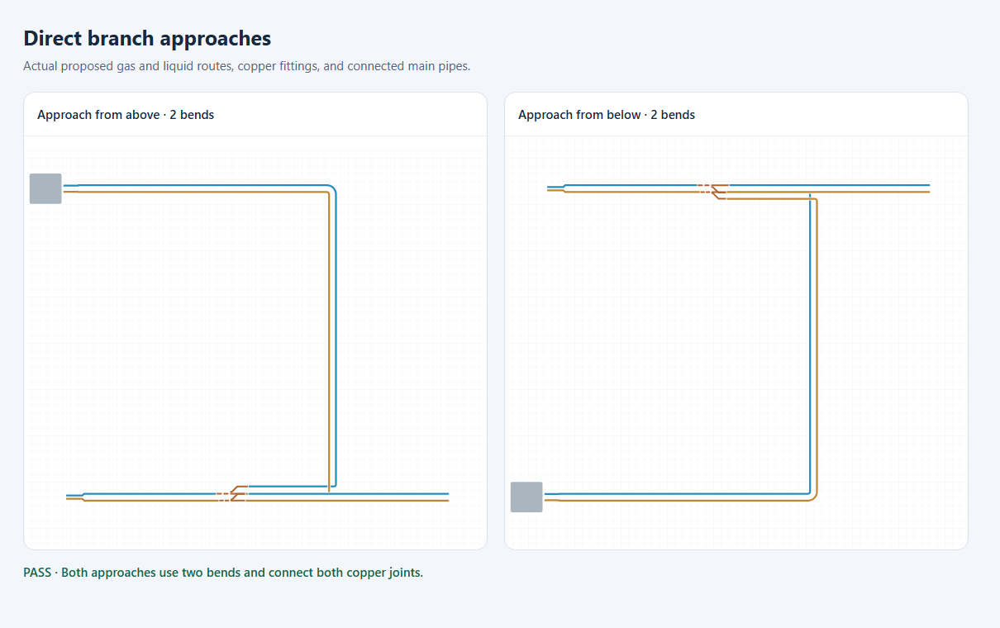
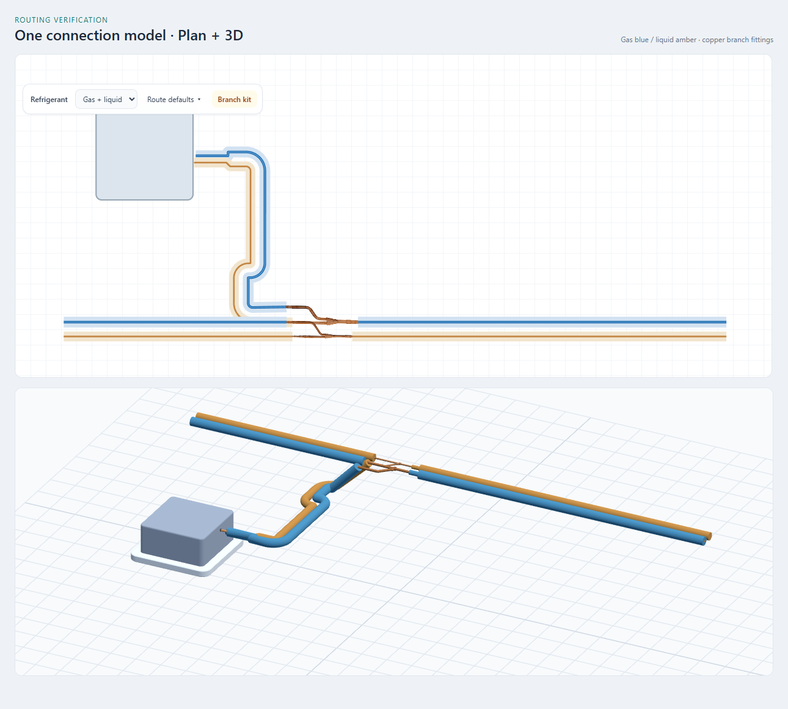

# Refrigerant routing: industry review and implementation

Reviewed 6 September 2026. This review informs interaction and connection geometry; it does not certify a refrigerant system or approve a particular branch-kit selection.

## Findings from primary sources

| Source | Observed practice | Application to ProvacX |
| --- | --- | --- |
| [Autodesk: routing preferences](https://help.autodesk.com/cloudhelp/2025/ENU/AutoCAD-MEP/files/GUID-DC5B76BF-0503-4F30-9228-96DE1E78AB8D.htm) | Routing preferences select fittings while drawing; alternatives can be previewed. Unsupported fittings, transitions and angles require a substitution. | Keep drawing continuous, preview the proposed physical connection, and make geometry acceptance distinct from catalog approval. |
| [Autodesk: pipe routing preferences](https://help.autodesk.com/cloudhelp/2021/ENU/AutoCAD-MEP/files/GUID-1BC9DCA0-A661-4107-A0BA-95710F46F7D8.htm) | Pipe and fitting size ranges must share compatible nominal sizes. Routing preferences encode the parts allowed for the system. | Gas and liquid identities and three fitting terminal roles are explicit. A generic modeled kit is identified as a layout proposal; diameter proximity is not manufacturer selection. |
| [MagiCAD: editing tools](https://www.magicad.com/tools/editing-tools/) | Network editing includes automatic crossings and elevation-offset changes through Smart Move. | Pair geometry, level changes and connected endpoints need coordinated edits. Isometric views should expose actual connections and levels. |
| [MagiCAD: piping](https://www.magicad.com/applications/magicad-piping/) | Product selection, device connections, pipe drawing and integrated calculations belong in one workflow. | Present a small connection proposal in the drawing workflow, with details available when they affect the choice. |
| [LG Multi V S installation manual, p. 58](https://legacy.lghvac.com/resource-service?filename=IM_MultiV_S_OutdoorUnits.pdf) | The inlet faces the outdoor unit; the two outlets face indoor units. Backward Y-branches and field-fabricated branching tees are prohibited for this system. Its indoor Y-branch rules specify at least 20 inches (508 mm) between the branch and other fittings/indoor units, with model-specific orientation limits. | Resolve the outdoor side from persisted network connections. Lock reversal when known. Avoid offering an ordinary tee as an interchangeable fitting. Use profile-defined straight lengths; these LG dimensions are not universal defaults for every manufacturer. |
| [LG Multi V Water 5 engineering manual, p. 90](https://legacy.lghvac.com/resource-service?filename=EM_MultiV_Water5.pdf) | Piping limits include separation, total/equivalent lengths and elevation differences. LG requires its LATS design workflow for this system. | A collision-free drawing cannot be labeled a manufacturer-approved design. Keep system compatibility, capacity sizing and full-network limits visible as separate verification needs. |

## Drawing, spacing and presentation

- The compact routing toolbar groups gas/liquid selection and branch placement. Route defaults open on demand. Insulated clear gap, free-route level and minimum unit-port straight length update persisted routing settings once on Enter/blur. Escape discards a draft value. Changing defaults does not cosmetically spread existing pipes.
- Unit takeoffs retain the physical port position, service identity, direction and individual gas/liquid elevations. A protected straight precedes the transition into the field spacing; where room permits the transition gathers at 45 degrees. Plan inputs carrying an elevation still receive plan snapping. Authoritative projected ports remain usable in 3D.
- Pair spacing comes from the authored gap or the actual continued fitting/pipe spacing. Perpendicular offsets and concentric bends maintain separation through turns; translating both lanes in a fixed world direction previously collapsed them together after a quarter turn.
- Plan rendering uses the physical lane paths and individual insulated diameters. Already sampled pair bends are not splined again, preventing small hooks near takeoffs. Simplified edit handles retain the real endpoint positions.
- Plan and 3D share lane geometry and endpoint levels. Generated level adapters reserve the port straight plus the elbow setback. Authored risers are preserved. Gas and liquid remain visually distinguishable in 3D, while branch bodies retain copper materials.
- Tube tessellation allocates samples to each bend rather than spreading them uniformly over the whole route, so a small elbow on a long run remains smooth. Opaque insulation does not require a hidden full-length copper core.
- A normal selection selects the linked pair by its persisted bundle identity. Manual kit placement snaps to compatible open services and connects both members of a recognized pair in one history command. Nearby unrelated lines are not assumed to be a pair.
- Raster branch symbols register all three socket positions to model ports. The removed presentation-only flip could move the picture without moving the physical ports; inlet reversal now uses the physical proposal orientation.

## Implemented branch behavior

- A pair proposal targets the exact gas and liquid host elements. The source run is excluded before nearest-target ranking. Both fittings share a station that leaves the configured straight run beyond each body, including reverse-authored hosts.
- Outdoor-side resolution follows persisted endpoint and branch-terminal identities. It does not infer connectivity from crossing lines. Inconsistent gas/liquid outdoor directions block insertion.
- The entire fitting footprint is checked against rotated indoor-unit clearance regions. Existing joint spacing is also checked. These are drawing-level checks, not a full building clash analysis.
- Each kit's base elevation accounts for its modeled local terminal height, so its physical centerline matches its own host pipe after insertion changes it to fixed placement.
- Accepting a proposal replaces both hosts atomically with inlet/outlet runs and a coordinated gas/liquid branch. All three terminals retain separate semantic IDs. Missing hosts, moved hosts and failed splits reject the operation rather than adding a misleading decorative connection.
- Preview and commit use the same branch-route builder. Authored route waypoints are retained in the guide, with the final approach fitted to the actual branch sockets. The guide reserves the configured branch straight length, and direction-aware approach legs avoid immediate reversals at sockets. Existing route cleanup can simplify self-intersecting or retraced guides.
- The proposal card says **Layout fits**, offers **Connect pair** and **Keep drawing**, and explains that kit sizing/system compatibility need manufacturer verification. A known outdoor connection replaces the reversal action with an orientation indicator.
- Enter/double-click accepts the currently previewed fitting. Invalid proposals keep the route active instead of committing an apparent connection. The proposal card stays inside the canvas at its edges; port labels disclose service/role and connection level near the cursor.
- Manual fitting snaps can filter gas/liquid identity, occupied ends and allowed inlet/outlet roles. Equal-distance targets are stable across scene ordering; invalid direction vectors do not produce snaps.

## Direct branch approaches (7 September 2026)

The previous connection helper assigned separate departure and arrival offsets to same-facing sockets. Joining those offsets through a middle lane introduced four elbows where one shared outside lane could use two. It also treated the last clicked waypoint as a socket with a mandatory departure straight, adding another unnecessary offset.

The branch builder now ranks a bounded family of orthogonal candidates by elbow count, then length. It considers straight and single-elbow connections first, followed by shared-lane and offset alternatives. Candidates reserve the configured straight pipe and elbow setbacks, retain socket directions, and reject immediate reversals and self-crossings. A clicked waypoint can be the next elbow; explicitly authored waypoints are retained. Both service routes must pass existing level feasibility and insulated-pipe clearance checks before acceptance. Preview and insertion retain the exact selected guide.

A branch socket uses its own configured straight requirement rather than inheriting a longer indoor-unit departure setting. An already aligned approach, including intermediate collinear waypoints, is preserved instead of extending it backward past its last elbow. Nearby-station recovery remains bounded to keep drawing responsive.

This ranks practical geometric alternatives; it is not a pressure-drop calculation or a global obstacle-routing solver. Required offsets remain available when simpler candidates fail the existing checks. Existing committed pipes are not silently rerouted.

## Limits and follow-up

The existing DIS-22-1G geometry remains a modeled catalog asset, not a verified selection for every brand, refrigerant, capacity or heat-recovery arrangement. Two-line proposals cannot represent every three-pipe or branch-controller system. Existing routing-profile values remain authoritative; no manufacturer rule was generalized from one manual.

Straight lengths, building penetrations, insulation requirements, system capacity, equivalent length and elevation limits require the correct project/manufacturer rule profile and complete network inputs. Legacy drawings remain readable. New branch connections always require physical host replacement, including drawings with the old presentation-only preference.

## Verification

Focused Vitest coverage exercises upstream orientation in both authoring directions, three-terminal topology, atomic/stale-host rejection, fixed-kit elevation, coordinated station clearance, rotated unit collisions, preview/commit route equality, shared pair identity, semantic snapping, occupied sockets and stable target ties.

The complete drawing-engine suite passes: **83 test files, 628 tests**. TypeScript checks pass for both the drawing engine and web application, and ESLint passes for the changed drawing-engine files. Regression coverage also includes pipe spacing through bends, repeated equipment-move reflow, exact endpoint levels, projected-port interaction, avoiding spline overshoot at unit takeoffs, mirrored two-bend approaches, and branch approaches with long indoor-unit departure settings.

A Chrome review harness rendered the actual SVG overlay and Three.js HVAC meshes together, without browser runtime errors. It verified a cassette-to-main connection through gas/liquid branch fittings, exercised committing/cancelling route defaults without changing existing geometry, and checked that proposal cards remain inside all four canvas corners. This is a focused renderer/interaction check, not an end-to-end project certification.

